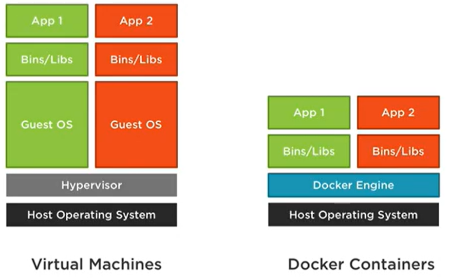
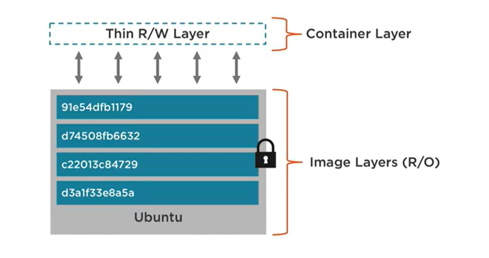
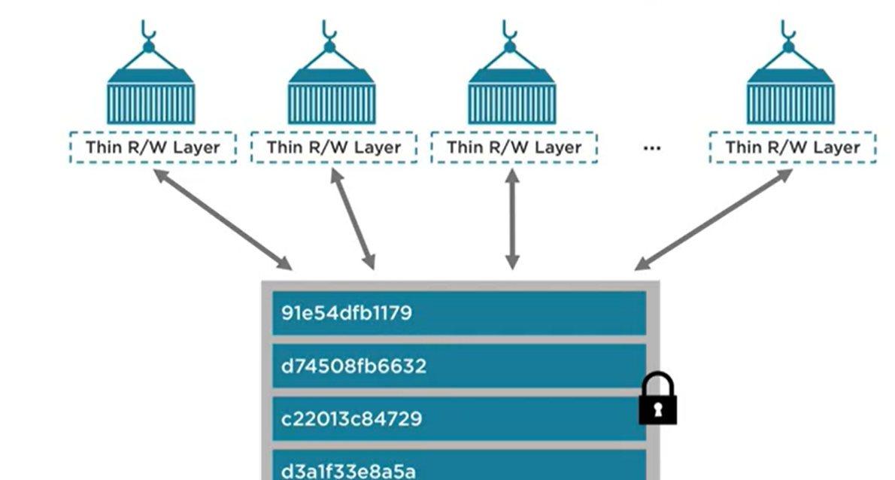
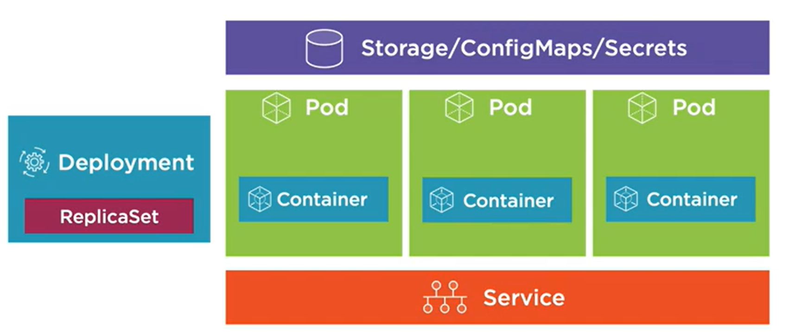
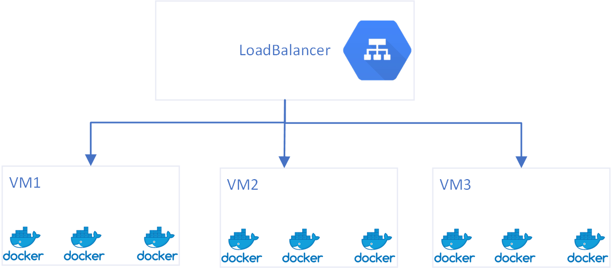
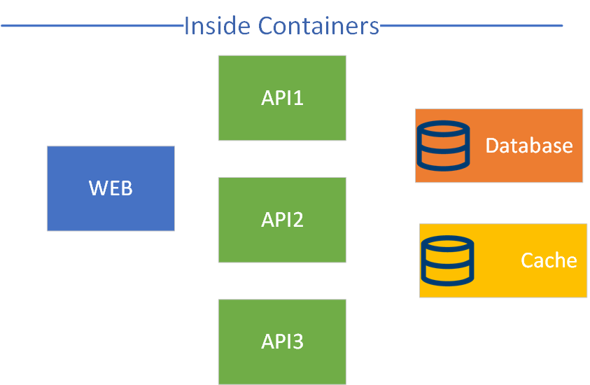
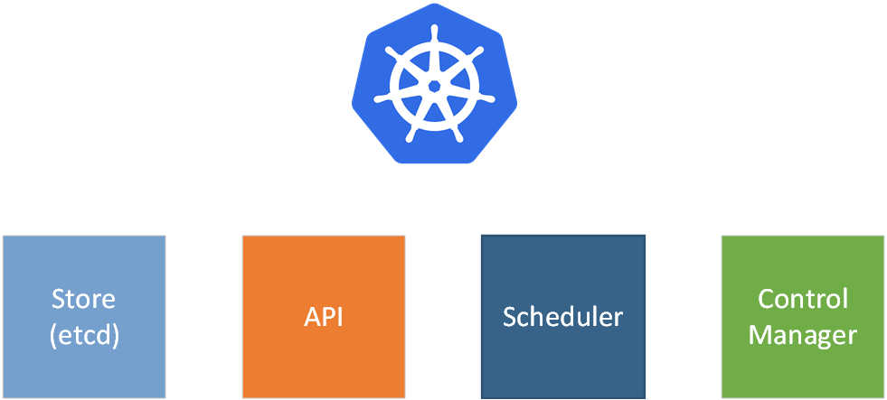
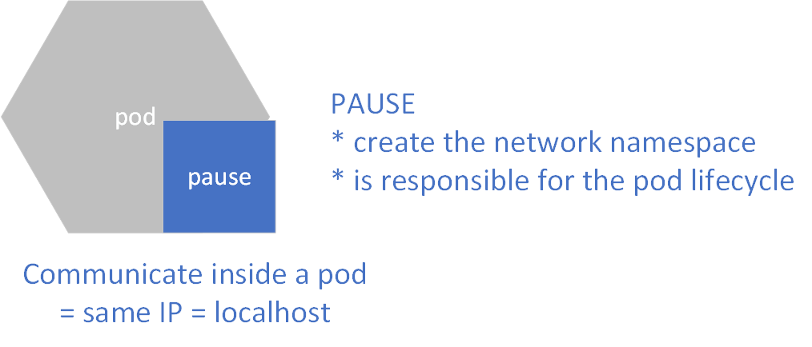
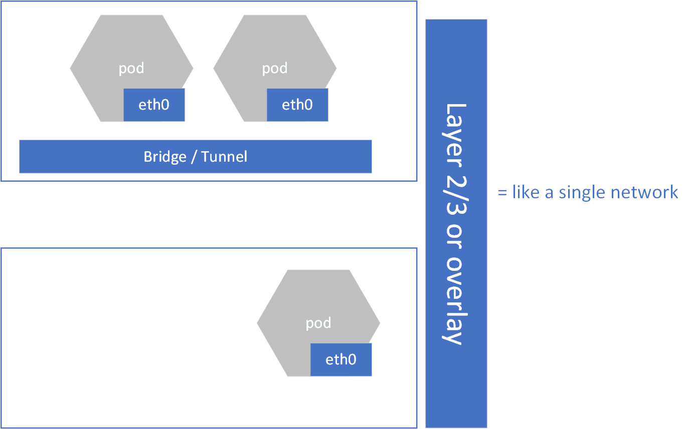

# Kubernetes at first sight

## Docker basics

what is docker ?

simplify containers 

run natively on linux 

but run anywhere (linux,macos,windows)

 and allow to ship code with infra (how to run the code)

## Kubernetes

describe the desired state

1- pods live and die

2- service abstract pods from IP addresses and load balances between pods

3- 

## Kubernetes from a developer perspective

Help to deploy, scale and manage containerized applications

key features:

* service discovery
* storage orchestration
* automate rollouts/rollbacks
* self healing
* secrets and configuration
* horizontal scaling

### Before kubernetes

we may load-balance on VirtualMachines running some docker containers.

These docker containers may look like the following :

But what happens if some containers crash or if the entire VM is down?

## What is Kubernetes

declarative: describe desired state

Inside kubernetes

* nodes : they are machines running kubernetes as a cluster
* pods: they wrap containers, they have one unique IP and can communicate with all other pods in the cluster
* services: define networking properties, allow to discover applications

* kubectl: use api to deploy workload with yaml manifests

on each node (machine):

* kubelet: agent on each node that will report to the control manager.

* container runtime: will allow running containers inside pods

* kube-proxy: responsible for the networking, will ensure that each pod get a unique address

Pod

Network

